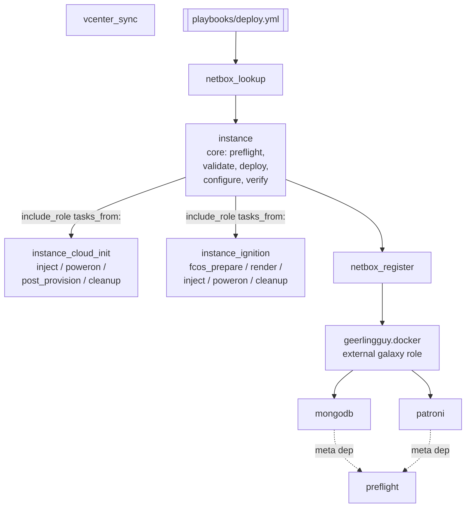
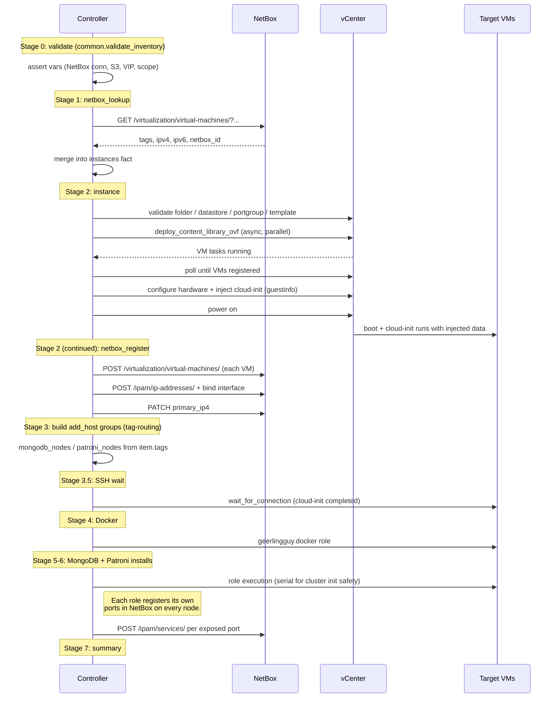
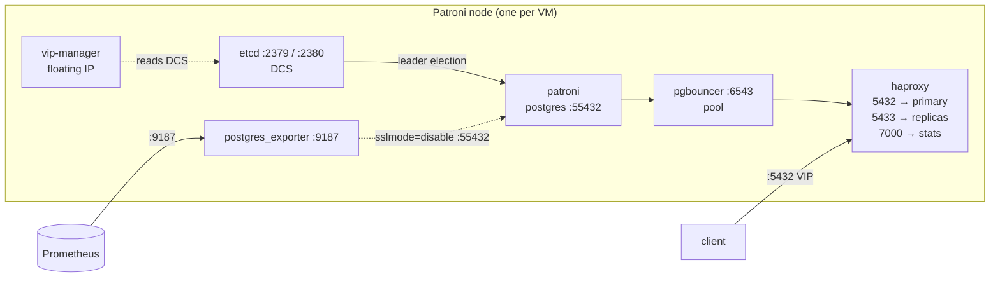
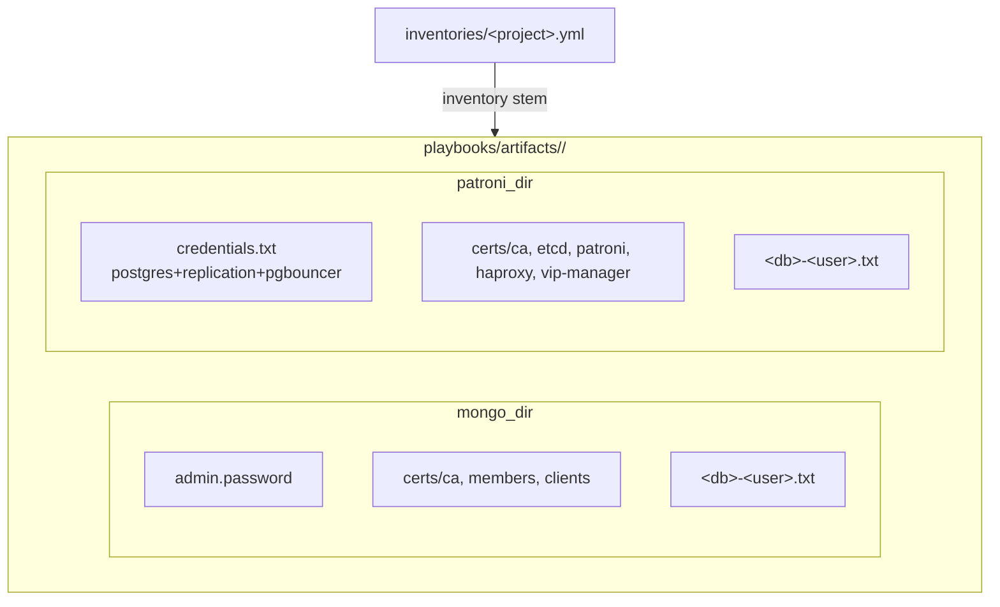
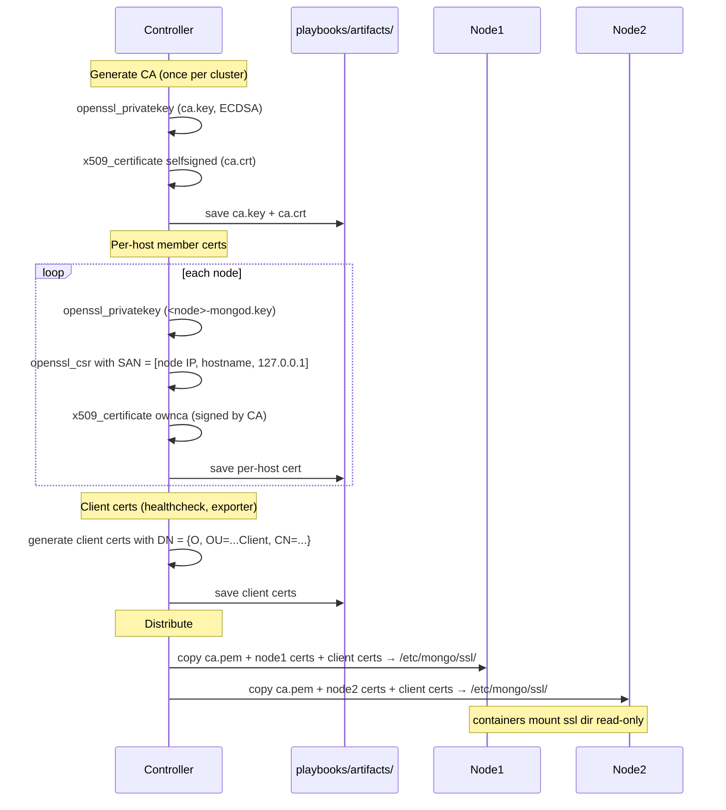
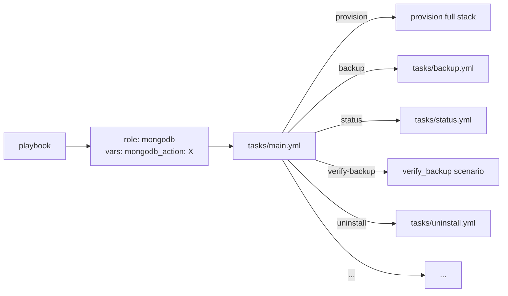

# Architecture

High-level data flow, role topology, and per-service container layouts.
Diagrams are Mermaid — GitHub / GitLab render them natively.

## Collection scope

```mermaid
flowchart LR
  inv[Inventory YAML] --> setup["playbooks/*/&#95;setup.yml"]
  setup -- enrichment --> nbf[netbox_lookup]
  nbf -- read-only --> nb[(NetBox)]
  nbf --> setup
  setup -- builds groups + artifacts_dir --> hostgroups[patroni_nodes &#47; mongodb_nodes]
  hostgroups --> provision[instance]
  provision -- REST &#47; SOAP --> vc[(vCenter)]
  provision -- register --> nbr[netbox_register]
  nbr -- write --> nb
  provision --> deploy[service role install]
  deploy --> mongo[mongodb role]
  deploy --> pg[patroni role]
  mongo --> artifacts["playbooks/artifacts/&lt;inv&gt;/"]
  pg --> artifacts
  mongo -- optional --> s3[(S3 / MinIO)]
  pg -- optional --> s3
```



The dashed line between `nbf` and `setup` represents a loop: `_setup.yml`
calls `netbox_lookup`, which updates the `instances` fact, which `_setup.yml` then
uses to build `add_host` groups.

## Role topology



- **`mongodb` / `patroni`** declare explicit meta deps on `preflight`.
- **`instance_cloud_init` / `instance_ignition`** are sub-roles of
  `instance`. They don't expose a `main.yml` entrypoint; `instance`
  includes specific phase tasks via `include_role: tasks_from:`. Split exists
  so the two init modes don't entangle in `instance`'s task tree.
- **`geerlingguy.docker`** is a third-party role from Galaxy — pulled in via
  `requirements.yml` and invoked directly from orchestration playbooks.

## Provisioning flow (`playbooks/deploy.yml`)



## MongoDB — container topology

```mermaid
flowchart LR
  subgraph "MongoDB node"
    mongos["mongos :27017<br/>client entry (sharded)"]
    configsvr["configsvr :27018<br/>cluster metadata (sharded)"]
    mongod["mongod :27019<br/>data"]
    exp["mongodb-exporter :9216"]

    mongos <--> configsvr
    mongos <--> mongod
    exp -. TLS X.509 .-> mongod
  end

  client["client / driver"] -- :27017 TLS --> mongos
  prom[(Prometheus)] -- :9216 --> exp
```

**Replicaset mode** collapses to just the `mongod` container; clients
connect to it directly on 27017.

## Patroni — container topology



**Client connection flow**: client → VIP (floats to current primary) →
HAProxy (http-checks Patroni REST API for `/primary`) → PgBouncer → Postgres.

## Artifact directory layout



Everything under `playbooks/artifacts/` is sensitive (see
[SECRETS.md](SECRETS.md)) and excluded from git.

## TLS PKI flow (MongoDB + Patroni)



CA keys live only on the controller (`playbooks/artifacts/<inv>/<svc>/certs/`)
unless explicitly distributed. On cert rotation (renew-certs playbook), a
rolling restart picks up the new leaf certs — CA itself is preserved unless
`rotate_ca=true`.

## Day-2 action dispatch

Both `mongodb` and `patroni` roles use an `<role>_action` variable to
select sub-flows from `main.yml`:



Every day-2 playbook includes the same two plays:
1. `hosts: localhost` — runs `_setup.yml` (NetBox enrichment, dynamic groups, artifacts_dir).
2. `hosts: <service>_nodes` — includes the role with `<role>_action: <action>`.

This is why adding a new action is just: (a) add the task file, (b) add the
conditional include in `main.yml`, (c) add a playbook wrapper. No new
dispatching mechanism.

## See also

- [docs/SECRETS.md](SECRETS.md) — vault + credential handling
- [README.md](../README.md) — setup, requirements, quickstart
- [roles/mongodb/README.md](../roles/mongodb/README.md) — MongoDB-specific details
- [roles/patroni/README.md](../roles/patroni/README.md) — Patroni-specific details
- [roles/netbox_lookup/README.md](../roles/netbox_lookup/README.md) — NetBox lookup modes
